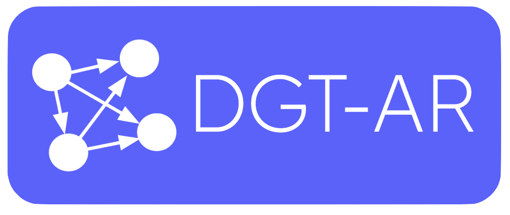
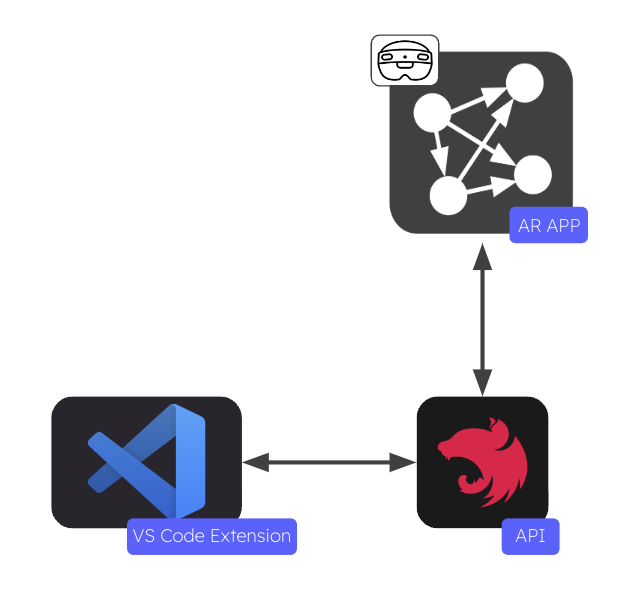
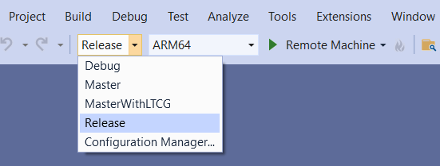
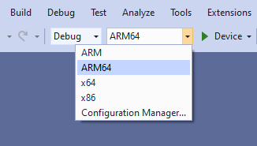
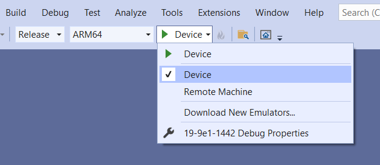
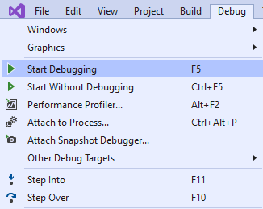
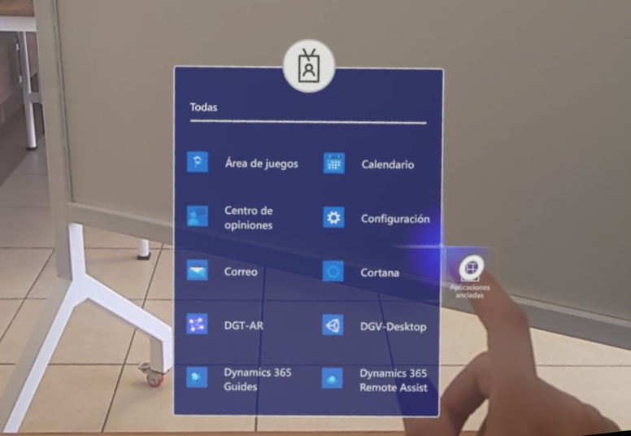

<p align="center">
  <a  target="blank"></a>
</p>

<p align="center"> 
Dependency Graph Tool in Augmented Reality (DGT-AR),a visualization tool that supports change impact analysis by allowing developers to interact with a code dependency graph in immersive AR. DGT-AR uses the node-link diagram visualization technique to provide an overview of the dependencies in a software system. 
</p>

<p align="center">
  <a href="https://www.microsoft.com/en-us/hololens/buy">
    
  </a>
  <a href="https://unity.com/es/download">
    
  </a>
  <a href="https://learn.microsoft.com/en-us/windows/mixed-reality/mrtk-unity/mrtk2/?view=mrtkunity-2022-05">
    
  </a>
  <a href="https://docs.nestjs.com/cli/overview">
    
  </a>
  <a href="https://nodejs.org/en">
    
  </a>
</p>

## App overview

DGT-AR is a visualization tool consisting of three essential components:

1. AR APP: The AR APP is designed for the Hololens 2 device and enables interactive viewing in augmented reality.

2. VS Code Extension: The VS Code Extension is an extension for VS Code that facilitates remote interactions with the display in the AR APP.

3. API: The API acts as a bridge between the VS Code extension and the AR APP. It handles graph state management and allows for the addition of datasets for visualization.

With these three integral parts, DGT-AR provides a comprehensive solution for visualizing data in augmented reality. It allows users to interact remotely, manage graph states, and incorporate datasets seamlessly into the visualization process. The flow that these 3 parts follow is represented in the following image

<p align="center" style="margin-top: 10px;">Image 1, App flow</p>
<p align="center">
  <a  target="blank"></a>
</p>

## API Installation
Before proceeding with the installation, please ensure that you have the required versions of Node.js and Nest.js installed, as specified at the beginning. Once you have verified the versions, you can proceed with the installation process.To install the API, start by cloning this repository onto your computer. Then, navigate to the root folder and execute the following command:

```bash
$ npm install
```

## Running the API 🚀

After successfully installing the API, proceed by executing the following command:

```bash
$ npm run start:dev
```

This command will compile and run the application, making it accessible at a specified port (3000). You can access it by opening a web browser and entering the URL http://localhost:3000.


## Change dataset in the API 👨‍💻

This project offers four datasets that are available for use. These datasets can be found in the src/assets folder:

* ```angular.js.json```
* ```mario.json```
* ```toy-dataset1.json```
* ```toy-dataset2.json```

To switch to a different dataset, please follow these steps:

1. Locate the file named ``` src/service/file/file.service.ts ``` in the project directory.
2. Open the file using your preferred code editor or IDE.

3. Find the line of code where where the dataset is imported and change the dataset name.

``` cs
  import * as jsonData from "../../assets/{DATASET_NAME}";
```
## Deploy DGT-AR in HoloLens 2 ⬆️
To deploy the application on HoloLens 2 devices, please follow these steps:

1. Begin by installing the necessary tools using the guide provided in [Microsoft's tools insallation guide](https://learn.microsoft.com/en-us/windows/mixed-reality/develop/install-the-tools#installation-checklist).
2. Download the built application from the GitHub repository [Builded AR APP](https://drive.google.com/drive/folders/1zYtktYTO4Eg8ZS-3ePWs-8W4caVLw6xP?usp=sharing).
3. Open your project in Visual Studio.
4. Expand the 'Compilation Options' dropdown and select 'Release'.
<p align="center" style="margin-top: 10px;">Image 2, Compilation Options</p>
<p align="center"></p>
<p align="center" style="margin-bottom: 10px;">Source: <a href="https://learn.microsoft.com/en-us/windows/mixed-reality/develop/advanced-concepts/using-visual-studio?tabs=hl2">Microsoft, 2023</a>

5. Choose 'ARM64' as the build configuration 

<p align="center" style="margin-top: 10px;">Image 3, Build configuration</p>
<p align="center"></p>
<p align="center" style="margin-bottom: 10px;">Source: <a href="https://learn.microsoft.com/en-us/windows/mixed-reality/develop/advanced-concepts/using-visual-studio?tabs=hl2">Microsoft, 2023</a>
    
6. Expand the 'Deployment Target' dropdown and select 'Device'.

<p align="center" style="margin-top: 10px;">Image 4, Target device</p>
<p align="center"></p>
<p align="center" style="margin-bottom: 10px;">Source: <a href="https://learn.microsoft.com/en-us/windows/mixed-reality/develop/advanced-concepts/using-visual-studio?tabs=hl2">Microsoft, 2023</a>

7. Select Debug > Start debugging to deploy your app and start without debugging

<p align="center" style="margin-top: 10px;">Image 5, Select Debug</p>
<p align="center"></p>
<p align="center" style="margin-bottom: 10px;">Source: <a href="https://learn.microsoft.com/en-us/windows/mixed-reality/develop/advanced-concepts/using-visual-studio?tabs=hl2">Microsoft, 2023</a>

By following these steps, you will be able to deploy the application on your HoloLens 2 device.

## Running the AR APP in HoloLens 2 🏃‍♂️

To run the application on the Hololens 2, follow these steps:

1. Open the main menu of the Hololens 2.
2. Search for the application called "DGT-AR."
3. Open the application.
<p align="center" style="margin-top: 10px;">Image 6, DGT-AR in the HoloLens 2 menu</p>
<p align="center"></p>


To install and run the extension in VS Code, navigate to the following  GitHub repository and follow the instructions provided in the README file. [VS code extension](https://github.com/DussanFreire/DGT-AR_VS-code-extension)

## Running DGT-AR
To run DGT-AR successfully, it is essential to start the three parts in the following order:
1. API
2. VS Code Extension
3. AR APP

## TechStack
<code></code>
<code></code>
<code></code>
<code></code>
<code></code>
<code></code>
<code></code>

